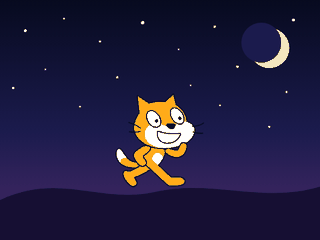

# MOG YOUR FACE

A browser game: your camera, your real face, your best **sigma face**.

## How to play

1. **Start camera** — allow camera access.
2. Hold your sigma face through the `3 · 2 · 1 · SIGMA` countdown, then the photo is taken.
3. Two buttons appear:
   - **See result** — scans the photo and shows your mog rating in %, plus every face shape (eyes, jawline, cheekbones, symmetry, face harmony, sigma aura) marked as *perfect* or *not perfect*.
   - **Restart photo** — throws the shot away so you can take it again if it came out wrong.

## When you get no mog

A score is not handed out for free:

- **No face in the photo** — nothing is scored. No face, no mog.
- **Face too far** — under 5% of the frame is too small to read any shape. Come closer and retake.
- **Normal face** — if you are smiling, the shapes are still listed but the verdict is **NO MOG**. A normal face never mogs anyone.

## Running it

Camera access needs a secure context, so open it over `localhost` or `https` (not `file://`):

```bash
python3 -m http.server 8000
# then open http://localhost:8000
```

No camera? The start screen has a **use a photo file** link that scans an image instead.

## How the scoring works

Nothing is faked with a random number — every score comes from the pixels of your shot:

- a skin-tone mask (YCbCr) finds the face box,
- the box is resampled to a 64×64 grey patch,
- **symmetry** = left half vs. mirrored right half,
- **eye shape** = contrast and spread in the eye band,
- **jawline** / **cheekbones** = edge energy in the lower and middle bands,
- **face harmony** = how close the box height/width is to the golden ratio,
- **sigma aura** = overall contrast plus how much of the frame your face fills.

A face only counts when the skin blob actually fills its own box (density), has a face-like height/width ratio, and covers enough of the frame — that is what stops an empty room from scoring. The smile check looks for teeth (bright, unsaturated pixels) and movement in the mouth band; an open smile is caught reliably, a tight closed-lip smile can still slip through.

The six traits are weighted into one mog rating. Same photo, same score — so a retake is a real retake.

Your best score of the session is kept in `localStorage`.

## Scratch Cat wave



`scratch/scratch-cat-wave.sb3` is a real Scratch project. Open it at
[scratch.mit.edu](https://scratch.mit.edu/projects/editor/) with **File -> Load from your computer**,
or in Scratch Desktop, then press the green flag.

Inside it:

- The **official Scratch Cat**: the sprite carries the editor's own `costume1` and `costume2`, its `Meow`
  sound, and the blank backdrop with the `pop` sound — the real asset files, under their Scratch asset
  names (the md5 of each file), taken from the Scratch editor's default project.
- Two extra costumes, `wave-down` and `wave-up`: the same official artwork with the cat's own arm path
  turned about its shoulder, the way you would rotate it in the paint editor.
- The script: `when green flag clicked -> say [Hi!] for 1 second -> forever [switch to wave-up, wait 0.2,
  switch to wave-down, wait 0.2]`. Two costumes and a wait, which is all a wave is. Click the cat to meow.

`python3 scratch/make-sb3.py` rebuilds the `.sb3` from `scratch/assets/` (the official files) — edit the
angles in `WAVE_POSES` to change how high the paw goes.

### The same thing in a browser

`scratch-cat.html` is a side page, not a Scratch project: the wave next to the blocks that make it, with a
slider on the `wait` value so you can see what the timing does. Its cat is hand-drawn SVG, so the page needs
nothing from the network.

```bash
python3 -m http.server 8000
# then open http://localhost:8000/scratch-cat.html
```
