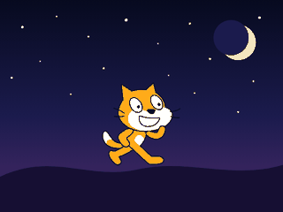

# MOG YOUR FACE

A browser game: your camera, your real face, your best **sigma face**.

## How to play

1. **Start camera** — allow camera access.
2. Hold your sigma face through the `3 · 2 · 1 · SIGMA` countdown, then the photo is taken.
3. Two buttons appear:
   - **See result** — scans the photo and shows your mog rating in %, plus every face shape (eyes, jawline, cheekbones, symmetry, face harmony, sigma aura) marked as *perfect* or *not perfect*.
   - **Restart photo** — throws the shot away so you can take it again if it came out wrong.

## When you get no mog

A score is not handed out for free:

- **No face in the photo** — nothing is scored. No face, no mog.
- **Face too far** — under 5% of the frame is too small to read any shape. Come closer and retake.
- **Normal face** — if you are smiling, the shapes are still listed but the verdict is **NO MOG**. A normal face never mogs anyone.

## Running it

Camera access needs a secure context, so open it over `localhost` or `https` (not `file://`):

```bash
python3 -m http.server 8000
# then open http://localhost:8000
```

No camera? The start screen has a **use a photo file** link that scans an image instead.

## How the scoring works

Nothing is faked with a random number — every score comes from the pixels of your shot:

- a skin-tone mask (YCbCr) finds the face box,
- the box is resampled to a 64×64 grey patch,
- **symmetry** = left half vs. mirrored right half,
- **eye shape** = contrast and spread in the eye band,
- **jawline** / **cheekbones** = edge energy in the lower and middle bands,
- **face harmony** = how close the box height/width is to the golden ratio,
- **sigma aura** = overall contrast plus how much of the frame your face fills.

A face only counts when the skin blob actually fills its own box (density), has a face-like height/width ratio, and covers enough of the frame — that is what stops an empty room from scoring. The smile check looks for teeth (bright, unsaturated pixels) and movement in the mouth band; an open smile is caught reliably, a tight closed-lip smile can still slip through.

The six traits are weighted into one mog rating. Same photo, same score — so a retake is a real retake.

Your best score of the session is kept in `localStorage`.

## Scratch Cat wave party



`scratch/scratch-cat-wave.sb3` is a real Scratch project. Open it at
[scratch.mit.edu](https://scratch.mit.edu/projects/editor/) with **File -> Load from your computer**,
or in Scratch Desktop, then press the green flag.

| | |
|---|---|
| green flag | the cat waves, forever, counting its waves |
| click the cat | meow, a pop of size, a burst of sparkles |
| space | a jump with a double spin |
| **P** | eight seconds of party: rave backdrop, hue cycling, the cat dances |
| **B** | next backdrop |
| hold the mouse | drag the cat around; it draws a rainbow behind it |
| **C** | wipe the drawing |

### What is in it

- The **official Scratch Cat**: `costume1`, `costume2`, its `Meow` sound, the blank backdrop and the `pop`
  sound are the Scratch editor's own asset files, carried under their Scratch asset names (the md5 of each
  file) from the editor's default project.
- Six more costumes made from that same official artwork by rotating the cat's own arm paths about their
  shoulders, the way you would in the paint editor: `wave-1` to `wave-5` for the wave, and `cheer` with both
  paws up for the dance.
- **The wave is a My Block**: it flips through the five costumes and back, one every 0.05 seconds, then
  counts a wave and throws a sparkle off the paw. Change the number where it is called to wave faster.
- A **Sparkle** sprite that exists only as clones — each one flies off the paw, spins, shrinks and fades.
- Four backdrops (night, sunrise, rave, retro grid) and a rainbow pen trail, both drawn in plain SVG.

### Building it

```bash
python3 scratch/make-sb3.py
```

`poses.py` re-poses the cat, `art.py` draws the sparkle and the backdrops, and `blocks.py` is a small
builder that turns readable Python into the block JSON an `.sb3` wants:

```python
cat.script(360, 260, [
    hat("event_whenkeypressed", KEY_OPTION="space"),
    play("pop"),
    repeat(12, [change_y(11), turn_cw(30), create_clone("Sparkle")]),
    repeat(12, [change_y(-11), turn_cw(30)]),
    point(90),
])
```

### Checking it

```bash
npm install scratch-vm scratch-storage scratch-parser
node scratch/check-sb3.js
```

That runs the file through `scratch-parser` — the validator scratch.mit.edu uses on an uploaded project —
and then plays it in `scratch-vm`, the engine the editor runs on: green flag, click, space, **P**, **B**,
mouse drag. It checks the wave reaches every costume, the sparkles are thrown, the jump peaks and lands
facing the same way, the party starts and ends on its own, and that nothing errors.

### The same thing in a browser

`scratch-cat.html` is a side page, not a Scratch project: the wave next to the blocks that make it, with a
slider on the `wait` value so you can see what the timing does. Its cat is hand-drawn SVG, so the page needs
nothing from the network.

```bash
python3 -m http.server 8000
# then open http://localhost:8000/scratch-cat.html
```
