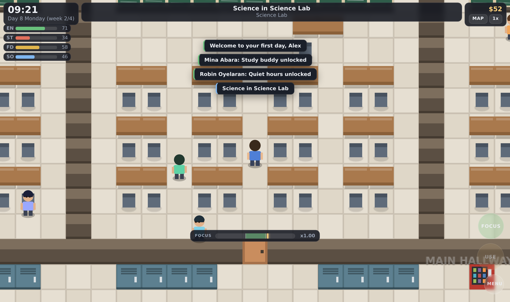
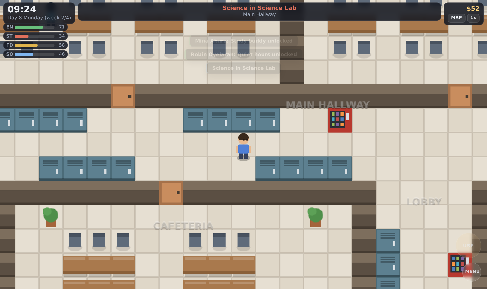
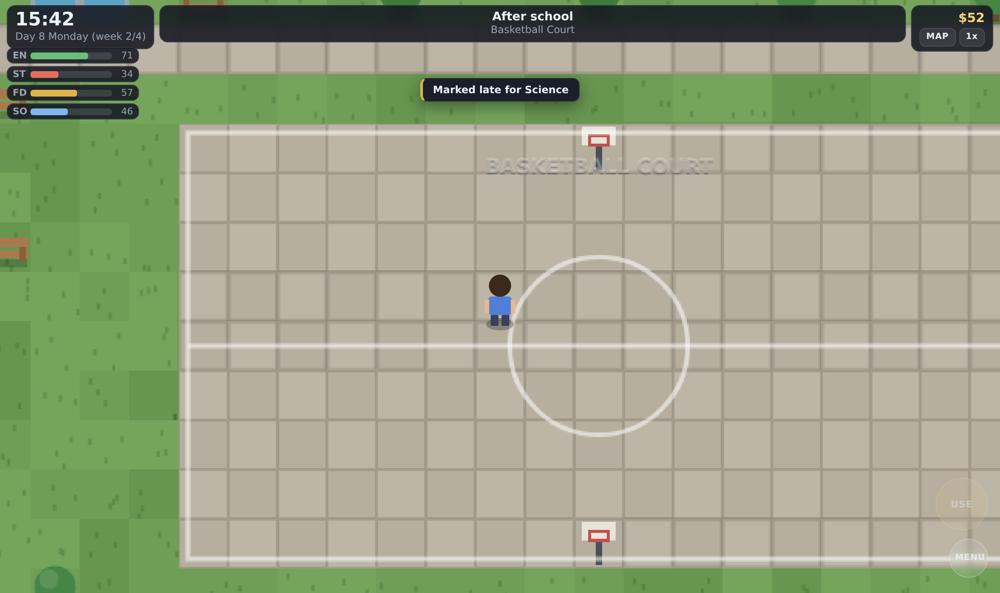
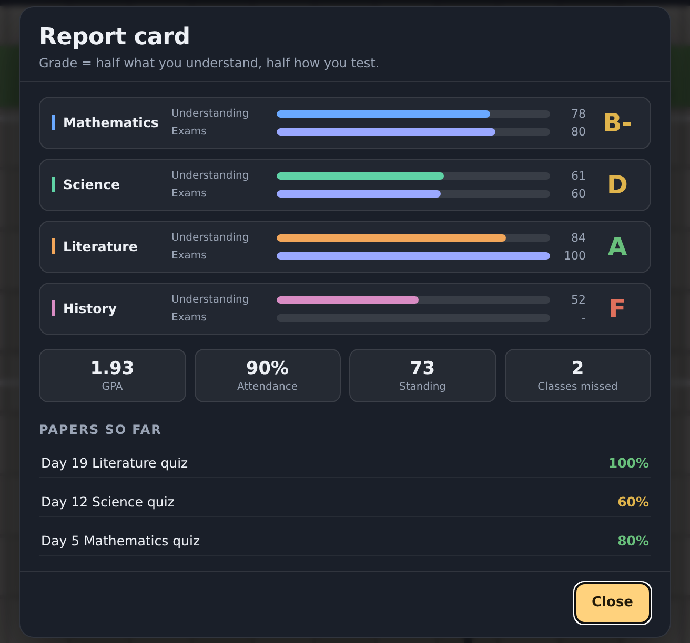
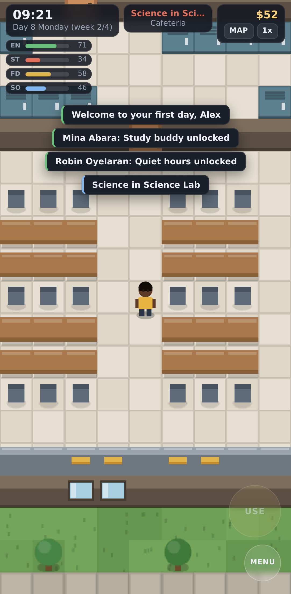

# School Simulator

A school life simulator. You play one student through one semester: go to
lessons, sit the papers, eat, sleep, train, argue with people in the library,
and try to reach the final exams without falling apart.

It is a single web game with no build step and no dependencies, so the same
files run on a PC browser, on Android, on iPhone and iPad, and on anything
else with a modern browser. It installs to the home screen and plays offline.



| | |
| --- | --- |
|  |  |
|  |  |

## Playing

The goal is the report card at the end of term. Each subject grade is half
what you actually understand and half how you perform on the paper, so
neither cramming nor coasting on quiz luck gets you an A on its own.

| What you manage | Why it matters |
| --- | --- |
| Energy | Drains all day. Low energy halves how much a lesson teaches you. |
| Stress | Climbs on its own and faster in class. Above 75 it wrecks your learning. |
| Food | Runs down over the day. Hungry costs you energy and concentration. |
| People | Friendships unlock perks: better study, cheaper workouts, shared notes. |
| Money | Allowance on Mondays, or work shifts at the canteen counter. |
| Attendance | Checked every period. Missing class costs standing and raises stress. |

Lessons run to a timetable. Be in the right room when the bell goes and you
learn; be somewhere else and you are marked absent. While a lesson is running
you can play the **focus** bar to learn up to about 1.6x faster.

There is a pop quiz most Fridays and a full set of finals on the last day of
term. Revision does not answer the questions for you, but a well-revised
subject crosses off one wrong answer per question.

### Controls

| Action | Keyboard | Touch | Gamepad |
| --- | --- | --- | --- |
| Move | WASD or arrow keys | Thumbstick: press and drag anywhere | Left stick / d-pad |
| Walk to a spot | Click the ground | Tap the ground | - |
| Run | Hold Shift | Push the stick fully | L3 |
| Use or talk | E, Space or Enter | The round USE button | A |
| Focus in class | F | The FOCUS button | Y |
| Menu | Esc or M | The MENU button | Start or B |
| Campus map | The MAP button | The MAP button | - |
| Change speed | T | The speed button | X |

The campus map is also a fast-travel screen: tap any room and your character
walks there on its own.

## Running it

**On a PC.** Open `index.html` in any browser. That is the whole install. To
get offline support and installability you need it served over HTTP:

```sh
npm start            # serves on http://localhost:8080
node tools/serve.js 3000   # or any other port
```

The server prints a LAN address as well. Open that on your phone and the game
runs there with no further setup.

**On Android.** Open the served address in Chrome, then use the menu and
choose *Install app* or *Add to Home screen*. It installs as a full-screen
app with its own icon and works with no connection afterwards.

**On iPhone and iPad.** Open the address in Safari, tap Share, then
*Add to Home Screen*. It runs full screen with the status bar respected.

**On any other phone.** Any browser released in the last few years will run
it. The layout adapts to portrait and landscape, respects notches and gesture
bars, and the touch controls appear only when you touch the screen.

### Building a real Android APK

The game is already a working Android app as a PWA, which is enough for most
uses. If you need a signed APK or AAB for the Play Store, `capacitor.config.json`
is set up for it and needs Node plus Android Studio:

```sh
npm install @capacitor/core @capacitor/cli @capacitor/android
npm run android:add     # creates the android/ project
npm run android:sync    # copies the game into it
npm run android:open    # opens Android Studio to build and sign
```

Bubblewrap (`npx @bubblewrap/cli init --manifest <url>/manifest.webmanifest`)
is the other route and produces a smaller trusted-web-activity APK. Neither
path was run here, so treat the commands as the documented route rather than
a tested one.

## Project layout

```
index.html                 markup, and the script order that boots the game
manifest.webmanifest       install metadata for Android, iOS and desktop
service-worker.js          offline cache; bump CACHE when files change
assets/css/style.css       all styling, mobile first
assets/js/core/            engine: input, audio, storage, pathfinding, helpers
assets/js/data/            content: the map, questions, cast, random events
assets/js/game/            simulation: schedule, state, exams, world, actions,
                           rendering, interface, and the main loop
tools/serve.js             dependency-free static server
tools/check.js             project self-check
tools/make-icons.py        regenerates the icon set
```

There is no bundler and no framework. Scripts are plain `<script>` tags that
attach to a single `window.SS` namespace, which is why opening the file
directly from disk works.

Everything you see is drawn at runtime: the tiles, the characters and the
icons are all code, and every sound is synthesised by the Web Audio API. The
repository contains no images or audio beyond the generated app icons.

## Development

```sh
npm run check     # parses every script, then checks the map, questions,
                  # cast, events, offline cache list, and the game balance
npm run icons     # regenerates assets/icons from tools/make-icons.py
```

`npm run check` plays three full semesters headlessly and asserts that the
game is still winnable and still losable: a player who attends everything and
passes the papers lands around a B+, one who also revises earns an A, and one
who never turns up fails.

Saves live in `localStorage` under `school-sim/save/v1`. The game saves
automatically every couple of in-game hours and whenever you background the
tab, and it still boots if storage is blocked or unavailable.

## Licence

MIT.
