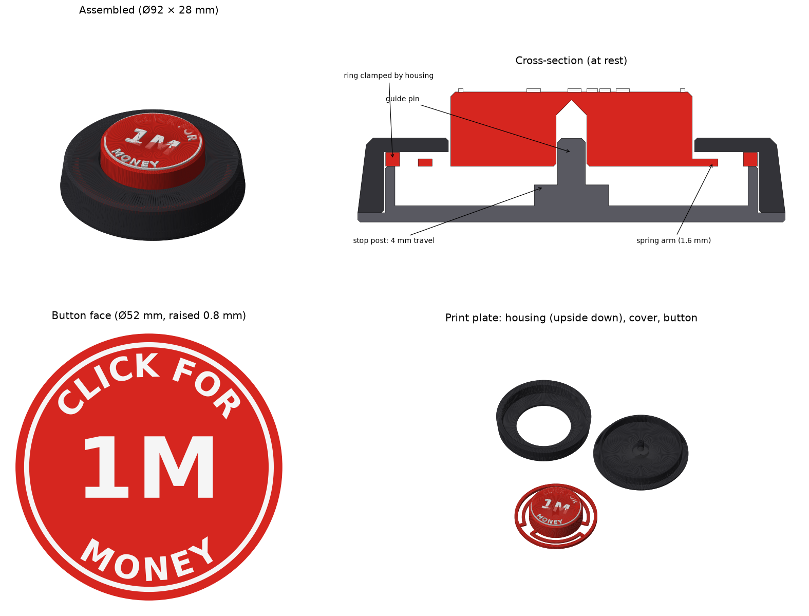

# CLICK FOR 1M MONEY — toy push button

A 3D-printable toy button that **really presses down and springs back up**. It is not a solid, fixed block. The red cap says **CLICK FOR / 1M / MONEY** in raised white letters.



**File to print:** [`click-for-1m-money-button.3mf`](click-for-1m-money-button.3mf)

## How it works

The cap sits on a thin plate with three curved arms that join it to an outer ring. The arms are the spring: pressing the cap bends them, and when you let go they pull the cap back up. The housing traps the ring from above and the cover holds it from below, so the button can't come out.

- Travel: **4 mm**. A post in the cover stops the cap, so the arms can't be bent too far.
- A pin in the cover runs up into the cap and keeps it moving straight down, even when you hit the edge.
- Press force is about **2 N (~220 g) in PLA** and about 130 g in PETG. This is a beam-model estimate, so real prints will vary a little.
- Size: Ø92 mm × 28 mm tall, with a Ø52 mm button.

## Parts (all in the 3MF, already placed for printing)

| Part | Colour | Notes |
|---|---|---|
| Button cap and spring | red | The spring arms are the first 1.6 mm (8 layers at 0.2 mm) |
| Button text | white | Separate part of the button object, sitting on the cap top |
| Housing | black | Already turned **upside down**, so its top face is on the bed |
| Cover | black | Flange down; has the stop post, guide pin and 6 crush ribs |

The three parts need a bed of about 195 × 195 mm. On a smaller printer, print them one at a time.

## Print settings

- PLA or PETG, 0.2 mm layers, 3 walls, 15–20 % infill.
- **No supports.** Every part prints flat without them.
- Skip the brim on the button so it doesn't join the spring arms together. The arms need good first-layer adhesion, so clean the bed.
- **White letters:**
  - Multi-colour printer (AMS/MMU): give the "Button text" part white filament.
  - Single nozzle: add a filament change at **16.0 mm** on the button.

## Assembly

1. Drop the button into the housing from below, with the cap going up through the hole.
2. Press the cover into the bottom of the housing until the flange meets the housing wall. Six small crush ribs on the cover make it a press fit.
   - Too tight: scrape the ribs a little.
   - Too loose: put a drop of super glue on the ribs.
3. Press the button. **Don't glue the button itself.** It has to move freely.

## Change the text or dimensions

The model is generated by [`make_button.py`](make_button.py). Edit `TOP_TEXT`, `CENTER_TEXT` or `BOTTOM_TEXT` at the top of the file. Dimensions are defined there too, for example `ARM_T` (thicker arms give a stiffer button) and `TRAVEL`. Then run:

```bash
pip install manifold3d fonttools matplotlib numpy
python3 make_button.py
```
