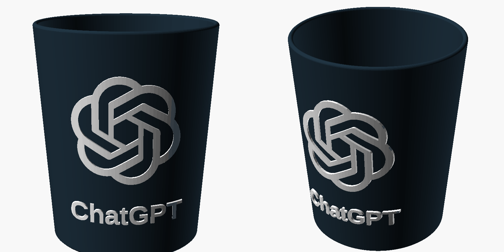

# ChatGPT cup

A 3D-printable cup with the ChatGPT logo and a **ChatGPT** label standing out on the front. The body is navy and the logo white, and in the 3MF they're separate parts, so a multi-colour printer can print them in two filaments.



| File | What it is |
| --- | --- |
| `chatgpt_cup.3mf` | Ready to slice. One object with two parts: **Cup** (extruder 1) and **ChatGPT logo** (extruder 2). |
| `chatgpt_cup.scad` | Parametric OpenSCAD source. Change the size, wall, label or logo. |
| `chatgpt_logo.svg` | The logo outline the model is built from. |
| `build_3mf.py` | Rebuilds `chatgpt_cup.3mf` from the source. |

## Size

- 84 mm wide at the rim, 70 mm at the base, 101 mm tall
- Holds about **400 ml**
- About 68 cm³ of plastic, roughly 85 g of PLA. Under 2 g of that is the logo.

## Printing

- Print it **upright, on its base, with no supports**. The logo stands out 1.2 mm, and its undersides are short enough to print without support.
- Layer height: 0.2 mm
- Walls: the wall is 2.4 mm thick. Set **6 perimeters** for a 0.4 mm nozzle, or use 100% infill, so the wall prints fully solid and doesn't leak.
- Bottom: 15 solid bottom layers at 0.2 mm, so the whole 3 mm floor prints solid.

### Two colours (AMS, MMU, IDEX)

Load navy (or black) as filament 1 and white as filament 2. In PrusaSlicer the logo part is already set to extruder 2. The colour changes only happen between 18 mm and 83 mm, where the logo is.

In Bambu Studio or OrcaSlicer, check the object list after opening the file. If the cup shows up as a single part, right-click it and choose **Split → To parts**, then set every logo and letter piece to your white filament.

### One colour

Just slice it. With a single extruder, the logo prints in the same filament as the cup. For contrast, paint the raised logo afterwards.

## Drinking from it

Plain FDM prints aren't food-safe. Bacteria can grow in the layer lines, and PLA softens in hot water or a dishwasher. If you want to drink from the cup, print it in PETG and seal the inside with a food-safe epoxy, and only use it for cold drinks. Otherwise, use it as a pen, brush or tool holder.

## Customising

Open `chatgpt_cup.scad` in [OpenSCAD](https://openscad.org). The parameters at the top show up in the Customizer panel:

- `height`, `bottom_radius`, `top_radius`, `wall`, `floor_thick`: the cup's shape
- `logo_size`, `logo_z`: the logo's width and height on the cup
- `label`, `label_size`, `label_z`, `label_font`: the text (set `label = ""` to remove it)
- `emboss`: how far the logo and text stand out
- `part`: `all`, `body` or `logo`, to export one part at a time

Then rebuild the 3MF (needs OpenSCAD and Python 3, takes about 30 seconds). Extra `-D` settings are passed on to OpenSCAD:

```bash
python3 build_3mf.py
python3 build_3mf.py -D 'label=""' -D height=120
```

The ChatGPT logo is a trademark of OpenAI. This is a fan-made design, not an official product, so keep the prints for personal use.
