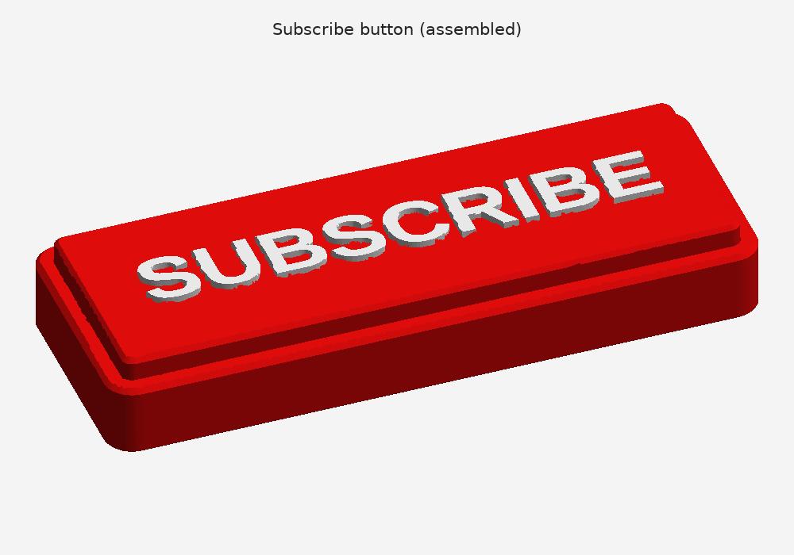
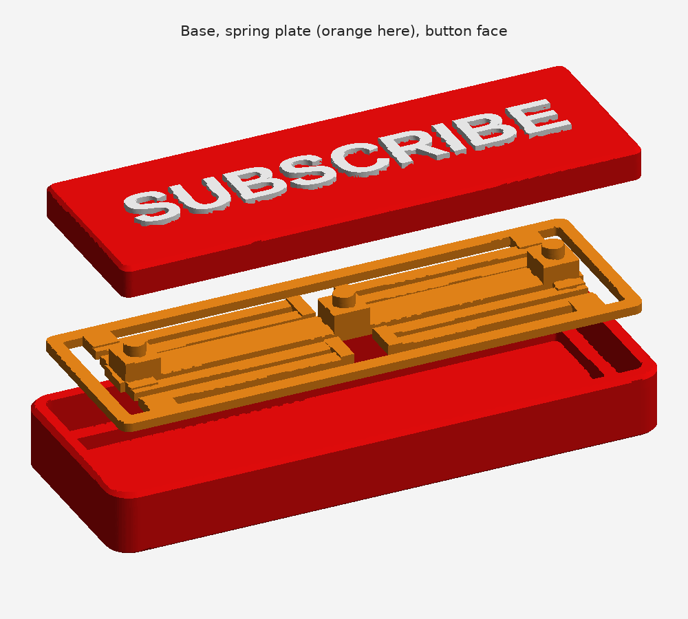
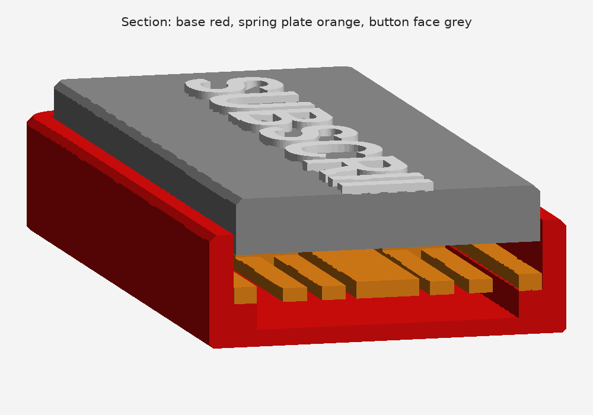

# SUBSCRIBE button

A 3D-printable copy of YouTube's red SUBSCRIBE button that you can really press. The whole red face with the white SUBSCRIBE text is the button: press it anywhere and it goes down 3.5 mm, then springs back up. The spring is printed plastic, so you don't need a metal spring or any screws.



## Try it before you print

Open `tester.html` in a browser (it needs an internet connection to load the 3D viewer). It shows the exact model from the 3MF. Click or tap the red face to press it, or hold to keep it down. **See inside** makes the base and face see-through, so you can watch the springs bend.

## Files

| File | What it is |
| --- | --- |
| `subscribe_button.3mf` | All three parts on one plate, laid out to print. Open this in your slicer. |
| `stl/` | The same parts as STL files, if your slicer handles those better |
| `tester.html` | 3D page where you can press the button before printing it |
| `make_subscribe_button.py` | The script that builds everything. Change the numbers at the top and run it again. |
| `make_tester.py`, `tester_template.html` | Build `tester.html` from the same geometry. Run `python3 make_tester.py` after changing the model. |

## Parts



| Part | Colour | How it prints |
| --- | --- | --- |
| **Base** | red | Standing up. It's a tray with a ledge round the inside and a shallow pocket below. |
| **Spring plate** | any (it's hidden) | Flat side down. A bar in the middle hangs on four folded springs from an outer frame, with three posts that hold up the button face. |
| **Button face** | red, with white text | Flat side down, text up. It has three holes underneath for the posts. |

None of the parts need supports.

## Printing

- **Material:** PLA works. PETG is better for the spring plate, because its springs last longer.
- **Layer height:** 0.2 mm.
- **Spring plate:** the first layer has to be clean. The springs are 1.6 mm thick with 1.5–3.5 mm gaps between them, and the gaps must not fuse together. Don't use a brim.

### White text

- **Multi-colour printer (AMS, MMU):** the button face loads as one object made of two parts, the face and the `SUBSCRIBE text`. Set the text part to white filament. If your slicer splits them into two objects, load `stl/button_face.stl` and `stl/button_text.stl` together as one multi-part object instead.
- **Single-colour printer:** print the button face on its own plate and add a filament change at the first layer above **7.0 mm** (7.2 mm with 0.2 mm layers). Switch to white there. The only thing above 7.0 mm is the lettering. Don't add the change on a plate that also has the base or the spring plate, because they are taller than 7 mm.

## Assembly

1. Put a few drops of glue on the ledge inside the base.
2. Drop the spring plate onto the ledge, posts up, and press its frame down. Keep glue off the springs.
3. Put a drop of glue on each post's peg, then press the button face onto the pegs, text up and the right way round.

Press the face: it goes down until the middle bar stops on the pocket floor, then springs back up.

## How it works



The section cuts across the button. The button face sits on posts on the middle bar (the carrier). Four folded springs, one near each end of the carrier on each side, hold it up. Each spring is two 39 mm arms joined by a U-turn. When you press, the arms bend down into the pocket. The pocket floor stops the carrier after 3.5 mm, so the springs can never be bent too far. At full press the face is still 1 mm above the rim, and 0.7 mm above the spring frame.

A full press takes about **3–4 N** (about the weight of 300–450 g). At full travel the plastic in the springs is stretched by about 0.55 %, which PLA and PETG take many times over. Pressing near one end tilts the face a little, like a keyboard's space bar.

For a firmer or softer button, change `ARM_T` in the script (1.8 mm is about 40 % stiffer, 1.4 mm about 35 % softer) and run it again:

```bash
pip install manifold3d numpy matplotlib
python3 make_subscribe_button.py
```

## Sizes

| | mm |
| --- | --- |
| Whole button | 126 × 46 × 18.7 (plus 1 mm of raised lettering) |
| Button face | 119.2 × 39.2, 4.5 above the rim |
| Press depth | 3.5 |
| Lettering | 99 wide, 12 tall, 1 raised |
