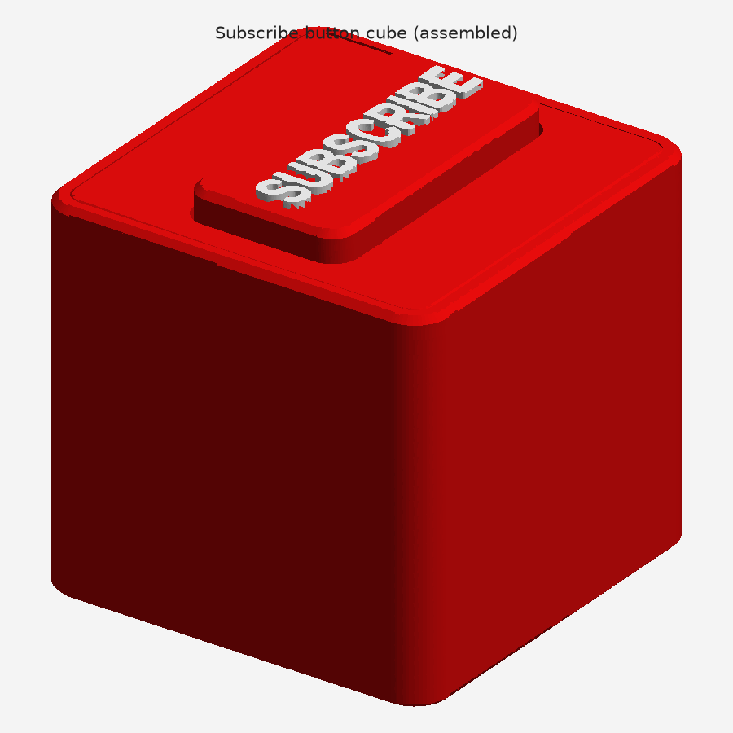
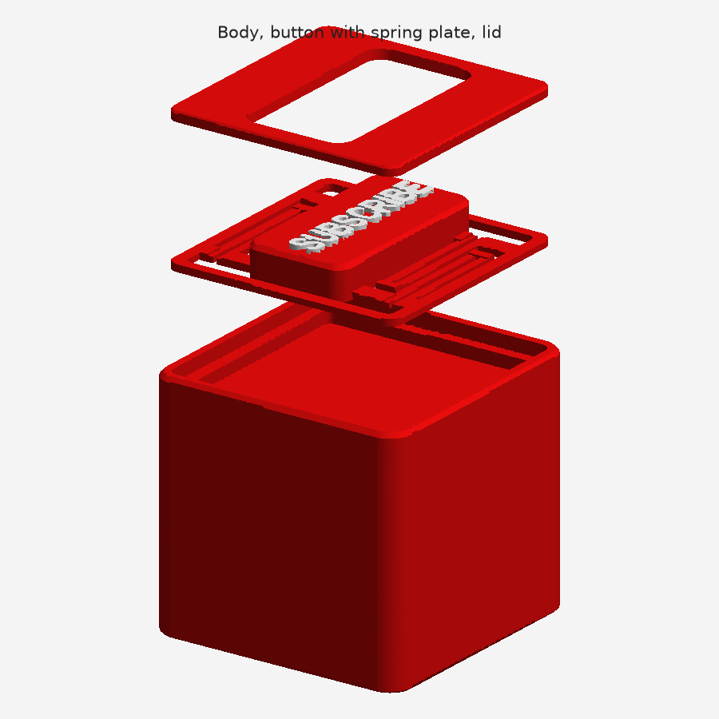
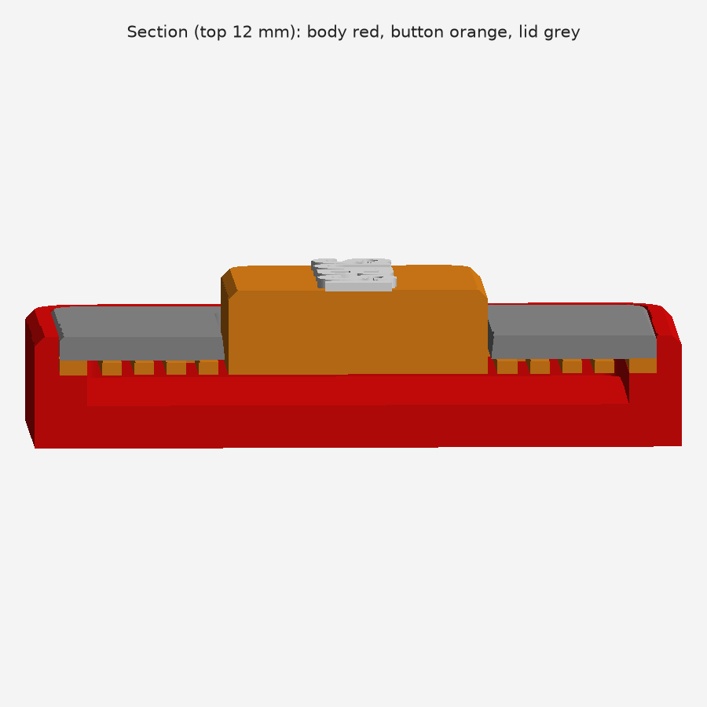

# SUBSCRIBE button cube

A red 70 mm cube with a white **SUBSCRIBE** button on top that you can really press. The button moves down 3.5 mm and springs back on its own. The spring is printed as part of the button, so you don't need a metal spring or any screws.



## Files

| File | What it is |
| --- | --- |
| `subscribe_cube.3mf` | All three parts on one plate, laid out to print. Open this in your slicer. |
| `stl/` | The same parts as STL files, if your slicer handles those better |
| `make_subscribe_cube.py` | The script that builds everything. Change the numbers at the top and run it again. |

## Parts



| Part | Colour | How it prints |
| --- | --- | --- |
| **Body** | red | Standing up. The top has a recess and a shallow pocket for the button. |
| **Button** | red, with white text | Flat side down. The cap sits on a thin spring plate: four folded springs join it to an outer frame. |
| **Lid** | red | Top face down (the plate is already flipped). It holds the spring frame in place. |

None of the parts need supports.

## Printing

- **Material:** PLA works. PETG is better for the button, because its springs last longer.
- **Layer height:** 0.2 mm. The springs are 1.2 mm thick, which is 6 layers.
- **Body:** 10–15 % infill is plenty, and the weight keeps the cube from sliding when you press it.
- **Button:** the first layer has to be clean. The gaps between the springs are 1.2 mm wide, so they must not fuse together. Don't use a brim.

### White text

- **Multi-colour printer (AMS, MMU):** the button loads as one object made of two parts, the cap and the `SUBSCRIBE text`. Set the text part to white filament. If your slicer splits them into two objects, load `stl/button.stl` and `stl/button_text.stl` together as one multi-part object instead.
- **Single-colour printer:** print the button on its own plate and add a filament change at the first layer above **9.0 mm** (9.2 mm with 0.2 mm layers). Switch to white there. The only thing above 9.0 mm is the lettering. Don't add the change on the plate with the body, or the body turns white from that height up.

## Assembly

1. Put the button in the recess on top of the body, cap up. Its frame sits on the ledge, and the springs hang over the pocket.
2. Put the lid over the cap, top face up, and press it down flush.
3. Put a few drops of glue around the lid's outer edge, where it rests on the frame. Keep glue away from the springs and the cap.

Press the button: it goes down until it stops on the pocket floor, then springs back up.



## How the button works

The section above cuts through the springs. Each corner of the cap has its own spring, made of two 30.5 mm arms joined by a U-turn. When you press, the arms bend down into the pocket. The pocket floor stops the cap after 3.5 mm, so the springs can never be bent too far.

A full press takes about **2–3 N** (about the weight of 250 g). At full travel the plastic in the springs is stretched by about 0.7 %, which PLA and PETG take many times over.

For a firmer or softer button, change `ARM_T` in the script (1.4 mm is about 60 % stiffer, 1.0 mm about 40 % softer) and run it again:

```bash
pip install manifold3d numpy matplotlib
python3 make_subscribe_cube.py
```

## Sizes

| | mm |
| --- | --- |
| Cube | 70 × 70 × 70, plus 1 mm of raised lettering |
| Button cap | 54 × 28, 5 above the lid |
| Press depth | 3.5 |
| Lettering | 48 wide, 8.5 tall, 1 raised |
